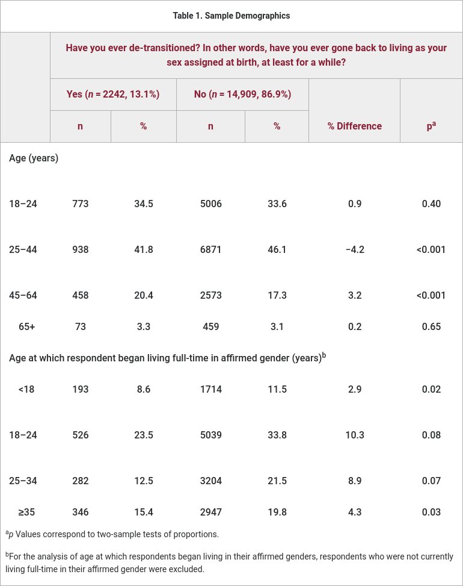
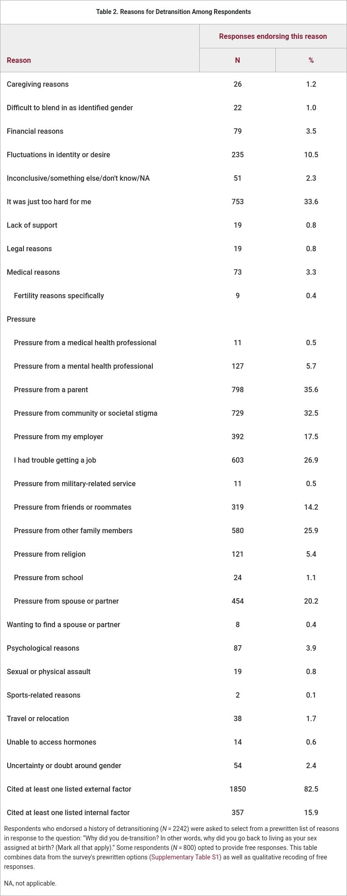

<h2>Introducción</h2>

Si el bloqueo de los sectores tránsfobos en la coalición de gobierno no lo impide, en breve se aprobará en España la [Ley para la igualdad real y efectiva de las personas trans y para la garantía de los derechos de las personas LGTBI](https://www.igualdad.gob.es/servicios/participacion/audienciapublica/Paginas/2021/apl-igualdad-efectiva-persona-trans-derechos-lgtbi.aspx), popularmente conocido como <<ley trans>> porque es el punto que más desarrolla la ley y porque introduce importantes cambios en la autodeterminación de género.

El anteproyecto dice en su artículo 37 que el cambio legal de la mención registral de sexo se podrá realizar a partir de los 16 años sin autorización de los progenitores o entre los 14 y 16 con asistencia de sus progenitores o representantes legales. En este último caso, si los progenitores o representantes legales no están de acuerdo, el asunto se resolverá judicialmente.

Este artículo además dice que el ejercicio del derecho a la rectificación registral de la mención relativa al sexo no requiere informe médico o psicológico ni a llevar a cabo ninguna transición de ningún tipo.

El caso de menores entre 12 y 14 años es tratado en la disposición adicional séptima de la ley que modifica la ley 15/2015 de la Jurisdicción Voluntaria para indicar que en ese caso el cambio tendrá que ser aprobado judicialmente aportando la documentación necesaria para acreditar que el menor <<ha mantenido de forma estable la disconformidad [de género]>> y podra <<solicitar la práctica de las pruebas que considere necesarias para acreditar la madurez necesaria del menor y la estabilidad de su voluntad de rectificar registralmente la mención a su sexo>>. Además, la autoridad judicial deberá informar al menor de <<la existencia de las medidas voluntarias de apoyo que estén a disposición de la persona solicitante en los ámbitos sanitario, social, laboral, educativo y administrativo>> y de <<la existencia de asociaciones y otras organizaciones de protección de los derechos en este ámbito a las que puede acudir>> para intentar garantizar que el menor reciba el apoyo necesario durante su transición.

# Transición social y transición física

Uno de los cambios más importantes que introduce la ley es eliminar la necesidad de realizar un cambio físico para poder solicitar el cambio de sexo en el registro.

Es decir, facilita una transición social al permitir el cambio de identidad de género legal sin necesidad de hacer una transición física ya sea quirúrgica, hormonal o de ningún otro tipo.

No hay mención al uso de bloqueadores de la pubertad en la ley ni como requisito para el cambio registral ni cambiando la regulación de su uso y administración ni ningún otro tipo de mencion. De hecho, como ya se ha mencionado, uno de los principales cambios que introduce esta ley es eliminar la necesidad actual de realizar una transición física (quirúrgica u hormonal) para poder realizar el cambio registral, algo que queda explicitamente recalcado en el punto 4 del artículo 37: <<El ejercicio del derecho a la rectificación registral de la mención relativa al sexo en ningún caso podrá estar condicionado [...] a la previa modificación de la apariencia o función corporal de la persona a través de procedimientos médicos, quirúrgicos o de otra índole.>>

Sin embargo, The Objective ha publicado recientemente un [artículo](https://theobjective.com/espana/2022-10-17/ley-trans-montero-2/) firmado por Lidia Ramírez para alertar de los peligros o errores de la ley trans centrándose en gran parte en el supuesto peligro, irreversibilidad y posterior arrepentimiento de las terapias hormonales de bloqueo de la pubertad (que, por otra parte, durante la adolescencia han demostrado ser seguras ([De Vries et al., 2011](#DeVries2011)), reversibles en la mayoría de los casos y con cuotas muy bajas de arrepentimiento ([Carmichael et al., 2021](#Carmichael2021); [Vrouenraets et al., 2020](#Vrouenraets2020)) e incluso con beneficios en la salud mental ([Kuper et al., 2020](#Kuper2020))). Y cita los casos de Francia, Reino Unido, Finlandia y Australia como inspiración del anteproyecto de ley español, países que, según el artículo, estarían dando marcha atrás en las decisiones que ahora España estaría intentando implementar con esta nueva ley.

Lo que pasa es que esta ley no introduciría cambios en al administración de bloqueadores de la pubertad, así que toda esa argumentación en The Objective sobre los bloqueadores de pubertad es irrelevante para el caso de esta ley y no merece ningún esfuerzo adicional verificar las afirmaciones del artículo sobre si eso supone un problema de esta ley, porque son cuestiones que no están mencionadas en el anteproyecto.

Esto forma parte de un intento a lo largo de todo el artículo de identificar autodeterminación de género con transición física, pero ni son la misma cosa ni la ley establece ninguna relación entre ambas.

Al contrario, el único cambio relacionado que introduce, como ya se ha mencionado, es que ya no es necesario someterse a una terapia de modificación para solicitar el cambio registral. Así que si a Lidia Ramírez le preocupa el uso de bloqueadores de la pubertad o cualquier otro tipo de cambio físico, debería estar a favor de esta ley que eliminaría la necesidad de su uso cuando no fuese deseado si se quiere hacer el cambio registral.

# Contexto internacional

El anteproyecto menciona en su exposición de motivos la influencia de resoluciones de la ONU y directivas de la Unión Europea en la elaboración, pero no hay niguna referencia a las legislaciones de Francia, Reino Unido, Finlandia o Australia ni he encontrado ninguna declaración en prensa que reconozca tales influencias ni tampoco hablando con personas conocedoras del tema. Las únicas referencias que he encontrado en ese sentido es de páginas web de una línea ideológica afín a The Objective que también habían citado anteriormente (sin referencias) la misma supuesta influencia de estos países en esta ley y la misma marcha atrás que supuestamente han dado esos países con sus legislaciones similares.

Haciendo un breve repaso por los países mencionados en el artículo de Lidia Ramírez como influyentes en la creación de la futura ley española, la de Reino Unido ha sido clasificada como de las peores de Europa por la Comisión Europea ([European Commission, 2020](#EuropeanCommission2020)) requiriendo <<requisitos médicos intrusivos>>, en Australia depende del estado con algunos requeriendo cirugía de cambio de sexo, Finlandia requiere esterilización y un diagnóstico de desorden mental y Francia requiere evaluación judicial para hacer el cambio de género en el registro.

Así que difícilmente ninguna de estas legislaciones puede haber sido una influencia para la española. Lidia Ramírez no menciona sin embargo otros casos más próximos a la futura ley española y que sí que pueden haber sido una fuente más probable de inspiración, como la Argentina, que permite la libre autodeterminación de género, o [la Noruega](https://www.regjeringen.no/en/historical-archive/solbergs-government/Ministries/hod/pressemeldinger/2016pm/easier-to-change-legal-gender/id2480677/), que también permite la libre autodeterminación de género a partir de los 16 años y va incluso más allá que la española permitiendo el cambio de género de 6 a 16 años con solo el consentimiendo de los progenitores desde 2016 (y por lo visto el país aún no ha colapsado desde entonces).

De hecho, hay muy pocos países que actualmente permitan la libre autodeterminación de género, así que el caso de España sería casi pionero, lo cual no es necesariamente malo. Similarmente, cuando España legalizó el matrimonio igualitario también había muy pocos países que lo permitieran y también en aquel momento los sectores más reaccionarios dijeron que iba a ser una catástrofe pero después no pasó nada, muchos otros países siguieron el camino abierto por España y otros países y hoy en día sería impesable una vuelta atrás en este sentido. Y ahora tenemos la oportunidad de estar otra vez entre los pioneros de un cambio social que dentro de unos años puede que volvamos a ver como imprescindible y necesariamente irreversible.

Así que parece que la influencia de los países mencionados por Lidia Ramírez y su posterior marcha atrás es una de esas afirmaciones que se repiten en páginas web de agitprop reaccionaria sin aportar fuentes y que se van propagando como un hecho real simplemente porque favorecen su relato.

Por lo tanto, tampoco merece la pena dedicar más esfuerzo en comprobar esas afirmaciones ya que no se ha demostrado (y la carga de prueba reside en The Objective y Lidia Ramírez) que la legislaciones de esos países hayan influido en el anteproyecto español y que hayan introducido cambios posteriores que tengan relación con la nueva ley. Los únicos cambios que menciona Lidia Ramírez que están introduciendo esos países son relativos a los tratamientos hormonales de bloqueo de la pubertad que, como ya se ha dicho, no están mencionados en ningún lugar de la futura ley trans, así que es pura argumentación inútil.

El artículo de The Objective es un compendio de afirmaciones similares sobre datos que o bien no están relacionados con esta ley pero sirven para crear un relato tránsfobo alarmista que se oponga a la ley, o están manipulados o son directamente falsos y llevan años repitiéndose en medios de agitprop reaccionaria. Así que vamos a seguir repasando sus afirmaciones.

# Construcción de la identidad de género

Ya hemos visto en qué consisten las condiciones para poder hacer el cambio registral de sexo, que se resumen en que se puede libremente cambiar legalmente de género a partir de los 16 años, de los 14 con autorización paterna y de 12 con autorización judicial. En ningún caso son necesarios bloqueadores de la pubertad, transición física o de ningún otro tipo y solo entre 12 y 14 será necesario presentar informes que lo avalen ante el juez.

El artículo de The Objective no miente directamente cuando dice que la ley contemplaría <<el cambio de sexo legal a partir de los 12 años>>, pero sin añadir ningún matiz podría dejar entender que a partir de esa edad el cambio de género legal es libre cuando ya hemos visto que eso solo es así a partir de los 16 años y entre 12 y 14 sería necesaria autorización judicial con informes que lo justifiquen.

En la misma oración también dice que <<contempla la medicación con bloqueadores de pubertad [...] a partir de los 12 años>>, pero los bloqueadores de pubertad no están mencionados en ningún lugar de la ley, como ya se ha dicho.

El cambio con control judicial hasta los 12 años, parental de 12 a 14 y libre a partir de los 16 es consistente con los datos disponibles que muestran que la identidad de género es más o menos estable ya a los 4 años ([Rafferty, 2022](#Rafferty2022)) y en cualquier caso, la edad más crítica para la construcción de la identidad de género no va más allá de los 13 años ([Steensma et al., 2011](#Steensma2011)).

Sin embargo, Lidia Ramírez dice que esta ley facilita el cambio de identidad de género en etapas <<que **se caracterizan por el descubrimiento**, entre otras cuestiones, **de su sexualidad**>> (negritas mías).

Aparte de que esto confunde la identidad de género (el género con el que se identifique uno) con la sexualidad (lo que atrae sexualmente a cada uno), este punto reincide en la clásica idea de que son épocas en las que las personas que se identifican como trans <<están confusas>> y <<se les acabará pasando>>.

Sin embargo, como se acaba de mencionar, la edad crítica para la construcción de la identidad de género es mucho más temprana que la edad a la que esta ley permite la libre autodeterminación de género. Pasada esa etapa de construcción de la identidad de género, es muy poco habitual que haya una vuelta atrás de las personas que se habían identificado como trans.

# Persistencia tras la transición

Un estudio de la Asociación Americana de Pediatría ([Olson et al., 2022](#Olson2022)) encontró que solo un 2.5 % de los adolescentes que se identificaron como trans, vuelven a identificarse con el género que se les había asignado al nacer tras cinco años.

Si queremos buscar datos más cercanos, la Unidad de Identidad de Género de Cataluña ([De Castro et al., 2022](#DeCastro2022)) informa que a lo largo de 18 años, el 97,6 % de los menores que recibieron en el centro <<persistió en su identidad transgénero después de una mediana de seguimiento de 2,6 años>>.

Otro estudio ([Turban et al., 2021](#Turban2021)) con una muestra mayor encontró que un 13.1 % de personas que se habían identificado como trans, volvieron a su género asignado al nacer tiempo después.

Este estudio, sin embargo, parece menos específico y riguroso ya que no hizo un seguimiento de los individuos a lo largo del tiempo como los anteriores, sino que se limitó a hacer una encuesta a varios individuos de distintas edades que habían declarado cambiar de género a distintas edades y después habían vuelto a su género asignado al nacer tras un tiempo indeterminado. Es decir, no se centra solo en el caso de adolescentes como los anteriores (y en lo que parece ser que se centran las preocupaciones de Lidia Ramírez) y, de hecho, la mayoría de los encuestados habían hecho su transición después de la mayoría de edad.

Sin embargo, este estudio aporta otros datos muy interesantes que son los miotivos por los que hicieron la transición de vuelta los que la hicieron. Y en la gran mayoría de los casos fue por presiones externas y muy pocos por arrepentimiento.

Es decir, si ya el porcentaje de personas que se habían identificado como trans y vuelven a identificarse con el género asignado al nacer es pequeño, es mucho más pequeño el porcentaje que lo hace porque habían dejado de identificarse como trans, siendo la mayoría de los motivos el rechazo familiar, el estigma, la dificultad para encontrar trabajo, etc.

No es que se hayan dado cuenta de que en realidad no eran trans, es que su entorno no les ha permitido serlo. Así que no es que haya que extremar la prudencia para facilitar la transición social, hay que facilitarla más todavía.

Sin embargo, el texto de The Objective dice:

> El 97% de los adolescentes que se declaran trans sufren problemas subyacentes sin tratar como el autismo, TDAH, TOC, trastornos alimenticios, depresión, ansiedad, etc; y el 71% tienen problemas para socializar. Y, además, según varios estudios internacionales, la disforia de género se supera entre un 75-90% de los casos, una vez pasada la adolescencia.

Queda por aclarar qué entiende Lidia Ramírez por <<superar>> la disforia de género. Entendida como la discordancia entre la identidad de género y el género asignado al nacer, una forma de superarlo puede ser completar la transición.

Sin embargo, el texto citado parece intentar transmitir el mensaje de que las personas trans tienen otros problemas psicológicos que podrían hacerles creen que son trans, pero después se les pasa esa disforia de género, una afirmación que parece totalmente ficticia a la vista de los datos disponibles, pero que de nuevo se ve repetido habitualmente en sitios tránsfobos y reaccionarios sin ninguna referencia que la respalde.

# Salud mental

Quién puede dudar de que la adolesciencia es una etapa difícil para todo el mundo. Pero no es hasta hace poco cuando se ha empezado a prestar atención a problemas de salud mental que pueden afectar a personas en una etapa tan difícil como la adolescencia como la depresión o la ansiedad. Si a eso le añades una crisis de identidad y la pertenencia a un colectivo que tradicionalmente y aún a día de hoy sigue siendo discriminado y humillado en edades en las que el sujeto es más vulnerable y el diferente es apartado de manera más despiadada, es lógico pensar que los problemas de salud mental sean mayores en adolescentes trans. Así lo demuestran los estudios ([Connolly et al., 2016](#Connolly2016)) que citan en hasta cuatro veces mayor la ocurrencia de problemas de salud mental como depresión o pensamientos suicidas en personas trans.

Los estudios ([De Vries et al., 2011](#DeVries2011); [Olson et al., 2016](#Olson2016); [Durwood et al., 2017](#Durwood2017); [Kuper et al., 2020](#Kuper2020)) con personas trans que han realizado la transición muestran que experimentan una mejoría en su salud mental que llega incluso a acercarse a la de las personas cuya identidad de género se corresponde con el género asignado al nacer, mientras que esa mejoría no se produce en las personas trans que no realizan la transición y no se identifican con el género asignado.

El artículo de The Objective, tras argumentar contrariamente a los datos existentes que <<cada vez son más las personas que se arrepienten de la transición>>, dice que <<el 97% de los adolescentes que se declaran trans sufren problemas subyacentes sin tratar como el autismo, TDAH, TOC, trastornos alimenticios, depresión, ansiedad, etc; y el 71% tienen problemas para socializar>> dejando implícitas las posibles conclusiones de que o las personas que se identifican como trans podrían estar haciéndolo como resultado de problemas subyacentes sin tratar, o bien que esos otros problemas son generados por haber iniciado la transición.

Los estudios disponibles ya mencionados muestran que esto es falso. La discordancia entre la identidad de género y el género asignado al nacer y, especialmente, factores externos como el rechazo social y familiar son los que provocan esos otros problemas y facilitar la autodeterminación de género es la manera de solucionarlos.

Hay pocas evidencias más solidas que las que muestran que facilitar la transición de personas trans es uno de los mayores factores para mejorar la salud mental de una población con tasas de pensamientos suicidas cuatro veces mayor que la media de la población debido a las presiones externas que sufren por su condición.

# Disforia de género de inicio rápido

A la vista de todo esto, ¿verdad que sonaría absurdo decir que hay adolescentes que deciden pasar voluntariamente por una experiencia tan dura sin sentirse realmente trans solo porque su entorno les presiona para hacerlo?

Pues hay gente que dice que eso pasa. Y esto es debio a un estudio llevado a cabo en 2018 entrevistando online a padres de páginas web tránsfobas que concluyó que ese fenómeno se llama disforia de género de inicio rápido y consiste en adolescentes que se declaran trans porque es la moda y quieren encajar.

Si todo eso suena a que es una estupidez, es porque lo es. Solo una mente perversa capaz de ignorar el rechazo y aislamiento social al que tiene que enfrentarse un adolescente trans durante los ya de por sí duros años de la adolescencia puede defender que un adolescente decide ser trans por encajar o por moda.

Tengo una pista para los padres que se sienten sorprendidos cuando sus hijos <<previamente normales>> (palabras de Lidia Ramírez) un día les comunican que son trans: no, no se han covertido de un día para otro por la presión social de encajar con una moda. Lo que es más probable que haya pasado es que vuestros hijos se hayan dado cuenta de que sois tránsfobos y os lo hayan estando ocultando por miedo.

La disforia de género de incio rápido no existe. Y una farsa de estudio que consistió en entrevistar por Internet a los miembros de foros tránsfobos no la va a hacer real.

Así lo han dejado claro las asociaciones de Psicología y Psiquiatría americanas en una [declaración](https://www.caaps.co/rogd-statement) con otras 60 organizaciones médicas que ya en su primer párrafo dice que no hay pruebas de la existencia de tal cosa.

Sin embargo, el artículo de The Objective dice que la existencia de la disforia de género de inicio rápido está avalada por <<diferentes sociedades científicas>> y dedica varios párrafos a defender este disparate contando como único referente la opinión de Amanda, una asociación de padres tránsfobos de hijos trans, que parece ser su única fuente para todas las afirmaciones tránsfobas de su artículo. En ningún momento a lo largo de todo el artículo se refleja la opinión de alguien que defienda la postura opuesta o (mucho menos) un experto.

Por suerte, aunque todavía queda mucho por hacer y a pesar de los intentos de los que quieren impedirlo, se siguen haciendo progresos cada día en la aceptación e visibilización de personas trans creando una sociedad más integradora (repito, aún queda mucho por hacer).

Eso hace que haya más gente trans visibilizándose y acudiendo a centros como las Unidades de Identidad de Género a buscar asesoramiento o ayuda cuando lo necesitan, lo que Amanda y Lidia Ramírez identifican como un aumento de la gente que se identifica (erróneamente, se entiende) como trans debido a la inexistente disforia de género de inicio rápido.

Probablemente no es que haya más gente trans (y, aunque lo fuera y eso les preocupara, eso solo evidenciaría su transfobia), sino que ahora acuden en mayor medida porque se sienten más seguros para no tener que ocultarse y eso es lo que hace que los números crezcan.

# Conclusión

No soy trans. No soy psicólogo. No soy una persona capacitada para tratar los desafíos a los que tiene que enfrentarse una persona trans.

Antes de escribir todo esto, he leído abundante documentación sobre investigaciones científicas, pero también he preguntado a personas trans como es su experiencia y como ven la situación actual y también he preguntado su punto de vista en distintas ocasiones a varios psicólogos. En algunos casos, me han hecho entender de manera distinta algunas ideas equivocadas que tenía.

Hay temas que son complejos y es muy difícil que podamos entenderlos bien desde el primer momento (especialmente si nuestra primera opinión se basa en prejuicios) y que nuestra forma de entenderlos no vaya a cambiar a medida que los investigamos más. No te resistas a cambiar tu punto de vista si nuevos datos así lo requieren. Habla con los afectados si no eres uno de ellos, ya que no hay otra forma de poder entender cómo se vive en primera persona. Si no eres un experto en el ámbito (o aunque lo seas), consulta con expertos cualificados y revisa cuál es el consenso científico y la investigación disponible.

Y, ante todo, duda de los artículos de prensa sensacionalistas con datos alarmantes que no están apoyados por ninguna referencia, sobre todo cuando hacen afirmaciones sorprendentes como que muchas personas se declaran trans para poder encajar y el 90 % se arrepiente después.

# Agradecimientos

Agradezco a las personas que colaboraron para corregir mis errores y aportar nuevas ideas, entre ellas, [Aurora](https://mastodon.social/@CorioPsicologia) de [Corio Psicología](https://corio.es).

# Referencias

Carmichael, P., Butler, G., Masic, U., Cole, T. J., De Stavola, B. L., Davidson, S., Skageberg, E. M., Khadr, S., & Viner, R. M. (2021). Short-term outcomes of pubertal suppression in a selected cohort of 12 to 15 year old young people with persistent gender dysphoria in the UK. *PLoS ONE*. <https://doi.org/10.1371/journal.pone.0243894>

Connolly, M. D., Zervos, M. J., Barone II, C. J., Johnson, C. C., & Joseph, C. L. (2016). The mental health of transgender youth: Advances in understanding. *Journal of Adolescent Health*. <https://doi.org/10.1016/j.jadohealth.2016.06.012>

De Castro, C., Solerdelcoll, M., Plana, M. T., Halperin, I., Mora, M., Ribera, L., Castelo-Branco, C., Gómez-Gil, E., & Vidal, A. (2022). High persistence in Spanish transgender minors: 18 years of experience of the Gender Identity Unit of Catalonia. *Revista de Psiquiatría y Salud Mental*. <https://doi.org/10.1016/j.rpsm.2022.02.001>

De Vries, A. L., Steensma, T. D., Doreleijers, T. A., & Cohen-Kettenis, P. T. (2011). Puberty suppression in adolescents with gender identity disorder: A prospective follow-up study. *The Journal of Sexual Medicine*. <https://doi.org/10.1111/j.1743-6109.2010.01943.x>

Durwood, L., McLaughlin, K. A., & Olson, K. R. (2017). Mental Health and Self-Worth in Socially Transitioned Transgender Youth. *Journal of the American Academy of Child & Adolescent Psychiatry*. <https://doi.org/10.1016/j.jaac.2016.10.016>

European Commission (2020). Legal gender recognition in the EU: The journeys of trans people towards full equality. Publications Office of the European Union. <https://doi.org/10.2838/50202>

Kuper, L. E., Stewart, S., Lau, M., & Lopez, X. A. (2020). Body Dissatisfaction and Mental Health Outcomes of Youth on Gender-Affirming Hormone Therapy. *Pediatrics*. <https://doi.org/10.1542/peds.2019-3006>

Olson, K., Durwood, L., DeMeules, M., & McLaughlin, K. A. (2016). Mental Health of Transgender Children Who Are Supported in Their Identities. *Pediatrics*. <https://doi.org/10.1542/peds.2015-3223>

Olson, K. R., Durwood, L., Horton, R., Gallagher, N. M., & Devor, A. (2022). Gender Identity 5 Years After Social Transition. *Pediatrics*. <https://doi.org/10.1542/peds.2021-056082>

Rafferty, J. (2022). Gender Identity Development in Children. healthychildren.org. <https://www.healthychildren.org/English/ages-stages/gradeschool/Pages/Gender-Identity-and-Gender-Confusion-In-Children.aspx>

Steensma, T. D., Biemond, R., de Boer, F., & Cohen-Kettenis, P. T. (2011). Desisting and persisting gender dysphoria after childhood: A qualitative follow-up study. *Clinical Child Psychology and Psychiatry*. <https://doi.org/10.1177/1359104510378303>

Turban, J. L., Loo, S., Almazan, A., & Keuroghlian, A. S. (2021). Factors Leading to “Detransition” Among Transgender and Gender Diverse People in the United States: A Mixed-Methods Analysis. *LGBT Health*. <https://doi.org/10.1089/lgbt.2020.0437>

Vrouenraets, L. J. J. J., de Vries, M. C., & Hannema, S. E. (2020). Trajectories of Adolescents Treated with Gonadotropin-Releasing Hormone Analogues for Gender Dysphoria. *Archives of Sexual Behavior*. <https://doi.org/10.1007/s10508-020-01660-8>
